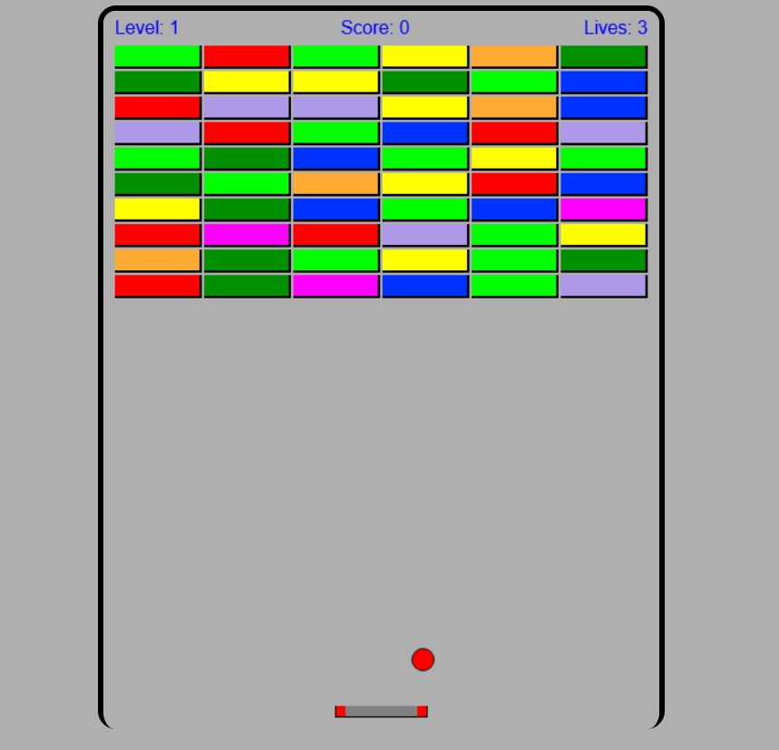

# BreakOut

## 💻 Informações

Clone do jogo Breakout de Arcade(1976) feito em JavaScript.

Controles: 

PC: Setinhas para Esquerda e Direita.

Mobile: Tocar no lado Esquerdo ou Direito da tela.

## 👨‍🏫 Testando

Você pode testar como ficou [clicando aqui](https://jncjcoder.github.io/breakout/index.html).